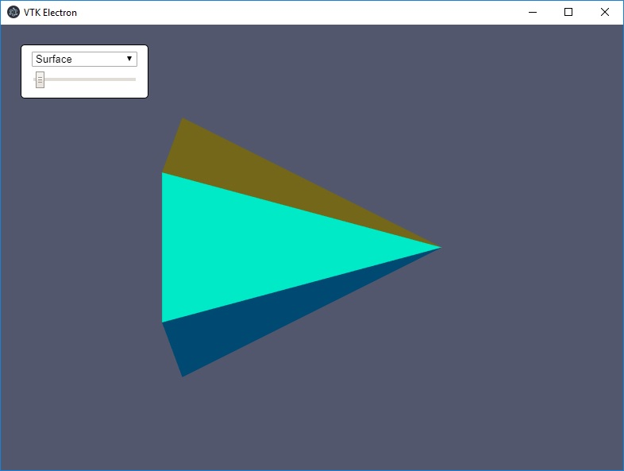

# vtkjs-electron-webpack
Combining vtkjs with electron using webpack

A hello world example referenced from https://kitware.github.io/vtk-js/docs/intro_vtk_as_es6_dependency.html

## Usage
1. Run `npm install` on root directory
2. Run `npm run build:dev`
2. Run `npm run dev-server` for web usage or `npm run electron` for electron build
3. To serve a release build, run follow command:
  - Windows: `npm run packager-win`
  - MacOS: `npm run packager-mac`
  - Linux: `npm run packager-linux`

## Screenshot

